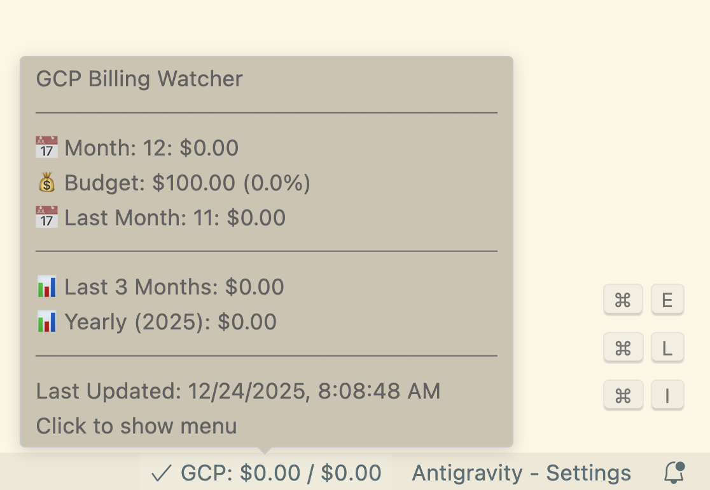

# GCP Billing Watcher

[日本語の説明はこちら (README_ja.md)](https://github.com/kkitase/gcp-billing-watcher/blob/main/README_ja.md)

A VS Code extension that displays your Google Cloud Platform (GCP) billing status (current month, annual total, etc.) in real-time right in the status bar.



## Quick Start

If you installed this from the Marketplace, follow these 3 simple steps to get started:

### Step 1: Enable Billing Export in GCP Console

1. Go to the [Billing Export page](https://console.cloud.google.com/billing/export).
2. Select your **Billing Account**.
3. Under the **"Standard usage cost"** section, click **"Edit Settings"**.
4. Select a **Project** and a **Dataset** (e.g., `billing_export`) to export data to, and save.
   - *Note: If you don't have a dataset yet, create one in the BigQuery console first.*

> 📝 **Important**: It may take **24 to 48 hours** for the first set of data to appear after enabling export.

### Step 2: Authentication (gcloud SDK)

The extension needs access to your GCP resources. Ensure the `gcloud` CLI is installed and authenticated:

```bash
# 1. Login to gcloud
gcloud auth login

# 2. Setup Application Default Credentials (Required)
gcloud auth application-default login

# 3. Set your active project
gcloud config set project <your-project-id>
```

### Step 3: Configure Project ID in VS Code

1. Open VS Code Settings (`Cmd + ,`) and search for `gcpBilling.projectId`.
2. Enter the **Project ID** where you exported your billing data in Step 1.

---

## Key Features

- 📊 **Status Bar Display**: See your current month's spending and annual total at a glance.
- 💡 **Detailed Tooltip**: Hover over the status bar to see last month's spending and a 3-month history.
- 💰 **Budget Alerts**: Set a monthly budget to change status bar colors based on usage.
- 🌐 **Multi-language Support**: Supports English and Japanese. Can be forced in settings.

---

## Troubleshooting

### Displaying "GCP: Error"
- Ensure "Billing Export" is correctly configured in the GCP console.
- Verify `gcloud auth application-default login` has been executed.
- If you just enabled export, data might be empty. Please wait up to 24-48 hours.

### Stuck at $0.00
- This is normal for new exports. It takes time for GCP to populate the BigQuery tables.

---

## For Developers

### Setup Script
If you've cloned the repository, you can use `setup.sh` to automate dataset creation and deployment:
```bash
./setup.sh <project-id>
```

### Manual Installation
Download the `.vsix` file from [GitHub Releases](https://github.com/kkitase/gcp-billing-watcher/releases) and use "Extensions: Install from VSIX...".

### Building from Source
```bash
git clone https://github.com/kkitase/gcp-billing-watcher.git
npm install
npm run compile
```

---

## License

MIT
